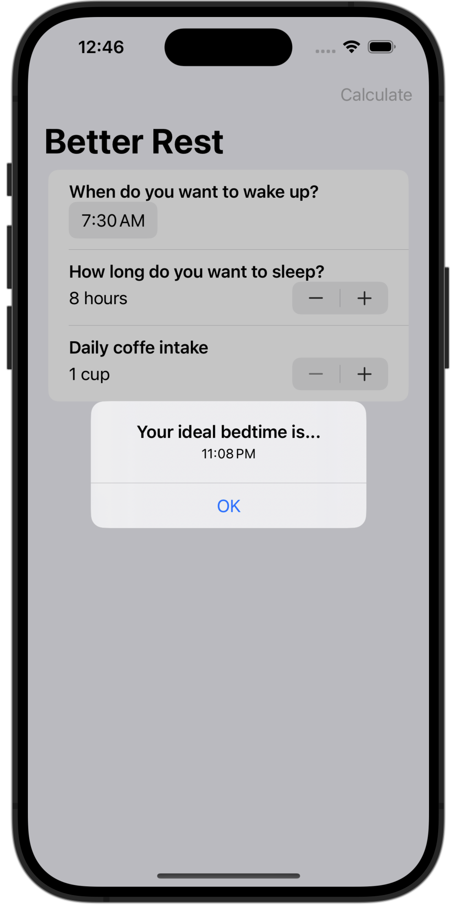

# BetterRest

BetterRest is an iOS application aimed at helping users determine the optimal sleep duration and wake-up time based on their daily schedule, leveraging the power of Core ML to provide personalized recommendations and enhance the user experience through intelligent data analysis.

## Screenshot

## Tech Stack

- **iOS Development**
  - Swift
  - SwiftUI
  
- **Other**
  - CoreML (for machine learning models)
  - Combine framework (for reactive programming)

## Features

- Sleep duration calculator
- Wake-up time predictor
- Integration with CoreML to leverage machine learning 

## Getting Started

1. Clone the repository.
2. Open the project in Xcode.
3. Build and run the application on your iOS simulator or a physical device.

## License

This project is licensed under the MIT License.
